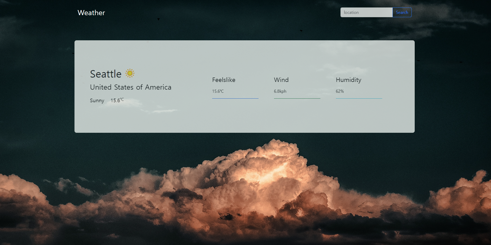

# Weather_App

URL:https://yongki95.github.io/Weather_App/

### Used Skills and API

1. HTML

2. CSS

3. Bootstrap

4. Javascript

5. Webpack

6. WeatherApi
### Description
A website that shows user given location's weather.

### Future Works

1. Add section that shows forecast weather.

2. Change background based on the user given location.
### picture Author

Photo by Peinge Nakale
https://unsplash.com/ko/@peinge_nakale995

website: Unsplash
